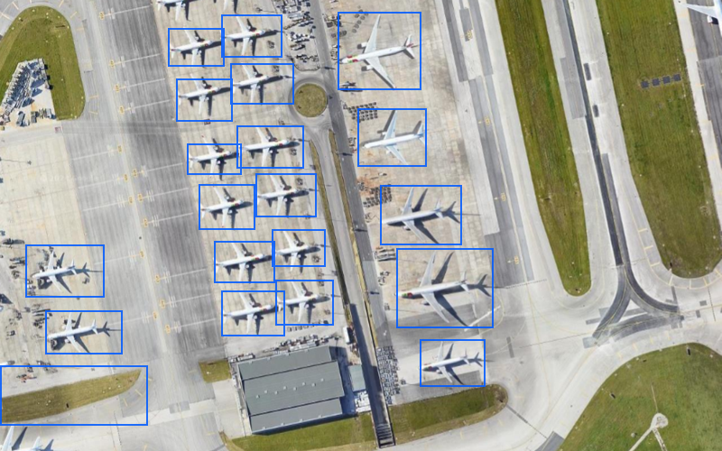
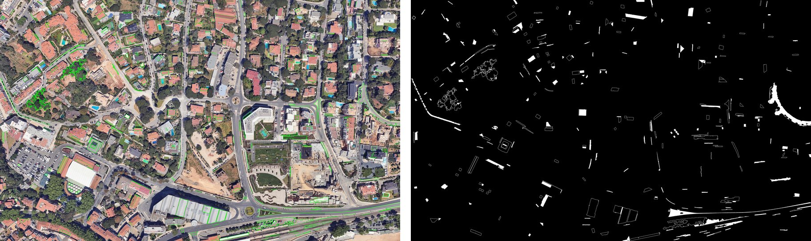

# PixelVision


Computer-vision utilities for satellite imagery, focused on YOLOv8 object detection and HSV-based segmentation.

## Example Outputs

YOLOv8 detection overlay:



Segmentation example, with the extracted segmentation output on the left and the corresponding binary mask on the right:



## What This Repo Contains

- `src/detection/` for YOLOv8 inference helpers
- `src/segmentation/` for HSV segmentation and contour analysis
- `examples/detect_and_segment.py` as a usable CLI example
- `models/` as a place to keep pretrained and custom weights
- `docs/` for usage notes and HSV guidance

## Prerequisites

- Python 3.8+
- A working OpenCV installation
- `ultralytics` and `torch` for YOLO inference

GPU support is optional. If CUDA is available through PyTorch, the detector will use it.

## Installation

```bash
python -m venv .venv
source .venv/bin/activate  # Windows: .venv\Scripts\activate
pip install -r requirements.txt
```

## Quick Start

Detection and segmentation on one image:

```bash
python examples/detect_and_segment.py path/to/image.jpg --mode all --model yolov8n.pt
```

Detection only:

```bash
python examples/detect_and_segment.py path/to/image.jpg --mode detect
```

Programmatic use:

```python
import cv2
import numpy as np
from src.detection.yolov8_detector import SatelliteDetector
from src.segmentation.hsv_segmenter import HSVSegmenter

detector = SatelliteDetector("yolov8n.pt", confidence=0.5)
detections = detector.detect("image.jpg")

segmenter = HSVSegmenter(
    hsv_lower=np.array([0, 30, 30]),
    hsv_upper=np.array([20, 255, 255]),
)
mask = segmenter.segment(cv2.imread("image.jpg"), adaptive=True)
```

## Models

`PixelVision` does not bundle large model weights by default.

- Standard Ultralytics model names like `yolov8n.pt` can be downloaded automatically on first use.
- Put any manually managed weights under `models/pretrained/` or `models/trained/`.

## Repository Layout

```text
PixelVision/
├── docs/
│   ├── HSV_REFERENCE.md
│   ├── INFERENCE.md
│   ├── MODEL_TRAINING.md
│   └── images/
│       ├── detection-sample.png
│       └── segmentation-sample.jpg
├── examples/
│   └── detect_and_segment.py
├── models/
│   ├── pretrained/
│   └── trained/
├── src/
│   ├── detection/
│   │   └── yolov8_detector.py
│   └── segmentation/
│       └── hsv_segmenter.py
├── requirements.txt
└── README.md
```

## Notes

- The HSV segmenter is designed for experimentation and will need tuning per imagery source.
- The detector wrapper is intentionally small; if you need training workflows, use Ultralytics directly and then point `SatelliteDetector` at the resulting weights.
- Example outputs are written to `output/` unless you override `--output-dir`.

## Contributing

Contribution guidelines are in [CONTRIBUTING.md](CONTRIBUTING.md).

## Citation

Citation metadata is available in [CITATION.cff](CITATION.cff).

## License

MIT. See [LICENSE](LICENSE).
